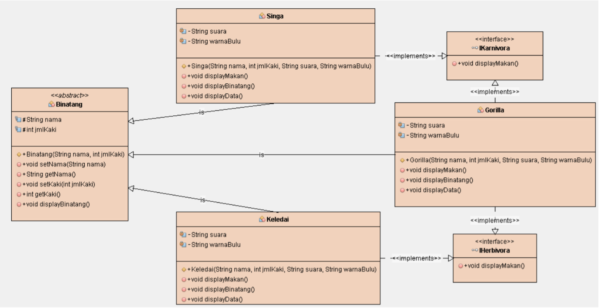

### Praktikum PBO 10
This is the tenth repository from PBO Practice in State Polytechnic of Malang. It is coded with Java Programming language. implements abstract class and interface program from given class diagram in Jobsheet.

- 📝 Pdf filename :[2C_24_Yudas Malabi.pdf](https://github.com/Yudas1337/Praktikum_PBO_10/blob/master/2C_24_Yudas%20Malabi.pdf)

### Main Topic : Overloading and Overriding
### Class Diagram : 

### Class Structure For Overloading :
<ul>
  <li>Binatang : Representing abstract Binatang class with some abstract method</li>
  <li>Ikarnivora : Representing interface class</li>
  <li>IHerbivora : Representing interface class</li>
  <li>Gorilla : Representing Gorilla class with inherit from Binatang and implements Ikarnivora, Iherbivora</li>
  <li>Singa : Representing Singa class with inherit from Binatang and implements Ikarnivora</li>
  <li>Keledai : Representing Keledai class with inherit from Binatang and implements Iherbivora</li>
  <li>Main : Run the java program from each declared class</li>
</ul>

### Technologies :
<ul>
<li>Java Object Oriented Programming</li>
<li>IDE : Visual Studio Code with java plugins for compiler</li>
</ul>

### Credits : Yudas Malabi 😄✌️
